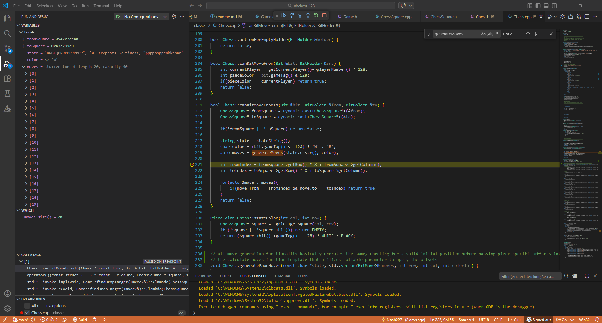
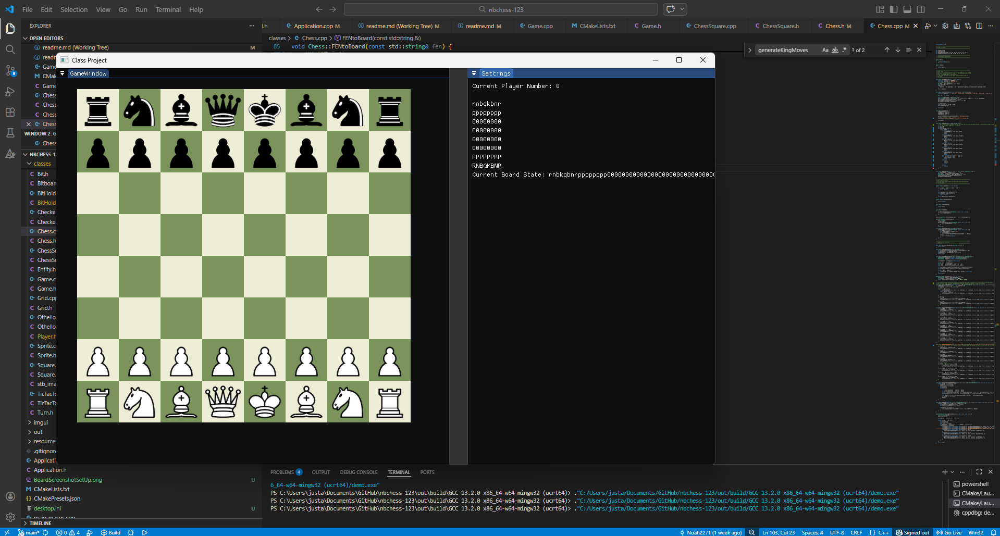

## Noah Billedo CMPM 123 - Windows PC

## Chess Implementation

### Chess.cpp
- Contains implementation of the 8x8 game board and basic movement without legality checks. Currently uses iterative generation for moves instead of bitboards. The board indexing is organized from the bottom left (0,0) to the top right (7,7). Movement is implemented via generatePiece() functions that utilize piece specific offsets that are passed into a a function template in the header file that then processes the moves by applying the move logic, mostly for pawns, and checking if the space is either empty or occupied by an enemy piece for capture. These moves are then stored into a vectorwhich is generated in the canBitMoveFromTo() function, and players are able to take the move if there is a move with a from-to index that aligns with the players desired move in the vector. There is no win/loss implementation yet.

- For negamax, the negamax algorithm is basically the same as the other two assignments. Board evaluation is relatively simple using a table of set piece values created in the game constructor that adds up to a total value for the board state. Implementing negamax wasn't too difficult but the hardest part was definitely efficienctly checking for a terminal state, including the functions I implemented checkForCheck and checkForWinnerString that primarily function by iterating through every player move to see if there's a way for the king to get out of check (keep itself from being captured). Which is relatively slow given it has to iterate through all those moves + iterate through the state string to check if the king was already captured to begin with. I didn't use this function for the aiTestForTerminal since it was slow.

- Current implementation of the AI runs at a depth of 5. The AI plays pretty aggressively since there is no piece square tables. If this part of the README isn't updated after 3/7/2026 then there still isn't any piece square tables. The AI is still far better than I am at chess, but that could mean anything since I haven't played chess in like a decade.

### Chess.h
- Contains function definitions and the function template for calculateMoves() which takes an equation that applies offsets and calculates moves. This function is the function that adds the move to the vector and also contains the logic that allows pawns to perform their diagonal captures.

### Most Recent Requested Screenshots
## Movement Vector Screenshot

## Board Screenshot

